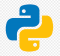

# Hi 👋 I am John
### Software/Game Developer

Over 8+ years of experience with games and 2+ education years in Software development experience. Basic knowledge in OOP and Unity Game Development. Adept in both Java, C# and Python programming along with hands-on project experience in development like Java and C#. Programed entire game logic in my first Game Jam event. Currently working on a personal project in Unity.

### Skills

### Socials
  
  

### Extra

<!--
**JohnKooo/JohnKooo** is a ✨ _special_ ✨ repository because its `README.md` (this file) appears on your GitHub profile.

Here are some ideas to get you started:

- 🔭 I’m currently working on ...
- 🌱 I’m currently learning ...
- 👯 I’m looking to collaborate on ...
- 🤔 I’m looking for help with ...
- 💬 Ask me about ...
- 📫 How to reach me: ...
- 😄 Pronouns: ...
- ⚡ Fun fact: ...
-->
